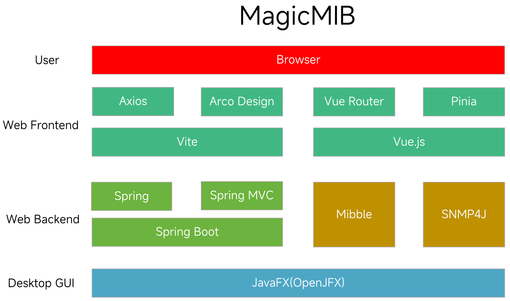

<div align="center">
  <a href="https://github.com/ZZHow1024/MagicMIB">
    
  </a>
  <h1>MagicMIB</h1>
</div>
<div align="center" style="line-height: 1;">
  <a href="https://github.com/ZZHow1024/MagicMIB/releases">
  </a>
  <a href="LICENSE">
  </a>
</div>

# **MagicMIB**（中文说明）

[**English**](./README_EN.md)

---

Website:

[MagicMIB（中文说明） | ZZHow](https://www.zzhow.com/MagicMIB)

Source Code:

https://github.com/ZZHow1024/MagicMIB

Releases:

[**https://github.com/ZZHow1024/MagicMIB/releases**](https://github.com/ZZHow1024/MagicMIB/releases)

---

## 它是什么？

**MagicMIB** 是一款基于 SNMP 协议的网络设备管理工具，提供图形化界面和 Web 界面，支持 MIB 浏览、SNMP Get/Set/GetNext/GetBulk/Walk/GetSubtree 等操作，帮助网络管理员轻松管理和监控网络设备。

---

## 技术路线



- **后端框架**: Spring Boot 3.5.8
- **前端框架**: Vue 3 + Vite
- **UI 组件库**: Arco Design Vue
- **SNMP 协议**: SNMP4J 3.9.6
- **MIB 解析**: Mibble 2.10.1
- **图形界面**: JavaFX 21
- **编程语言**: Java 21, JavaScript/TypeScript
- **构建工具**: Maven (后端), pnpm (前端)

---

## 许可证

该项目根据 GNU 通用公共许可证 v3.0 获得许可 - 有关详细信息，请参阅 [LICENSE](./LICENSE) 文件。

---

## 功能特性

### 核心功能

- **MIB 浏览器**: 可视化 MIB 树结构，支持 MIB 文件加载和管理
- **SNMP 操作**:
  - **Get**: 获取指定 OID 的值
  - **GetNext**: 获取下一个 OID 的值
  - **GetBulk**: 批量获取多个 OID 值
  - **Walk**: 遍历指定 OID 后的所有数据
  - **GetSubtree**: 获取指定 OID 子树的所有数据
  - **Set**: 修改设备配置参数
- **多协议支持**: SNMP v1/v2c (v3 开发中)
- **身份认证**: 支持读写共同体名配置

### 界面特性

- **双界面模式**：
  - **桌面应用**：基于 JavaFX 的图形化启动界面
  - **Web 应用**：基于 Vue 3 的响应式 Web 界面
- **实时结果展示**：表格化展示查询结果
- **对象详情**：显示 MIB 节点详细信息（名称、OID、语法、权限、状态、描述）
- **便捷操作**：一键式操作按钮，简化工作流程

---

## 系统要求

### 后端运行环境

- **Java**: JDK 21 或更高版本
- **Maven**: 3.6 或更高版本
- **操作系统**：Windows 10+, macOS 11+, Linux

### 前端运行环境

- **Node.js**: 20.19.0 或 22.12.0+
- **pnpm**: 推荐使用 pnpm 作为包管理器

### 浏览器要求

- 现代浏览器（Chrome, Firefox, Edge, Safari）最新版本
- 支持现代 JavaScript 特性

---

## 快速开始

### 方式一：使用已编译的程序

1. 访问 [Releases](https://github.com/ZZHow1024/MagicMIB/releases) 页面下载最新版本
2. 根据您的操作系统选择对应的安装包
3. 运行程序：
   - **Windows**: 双击 `.exe`/`.smi` 安装包、`.zip`压缩包解压运行或运行 `.jar` 文件
   - **macOS**: 安装 `.dmg`/`.pkg` 或运行 `.jar` 文件
   - **Linux**: 安装 `.deb`/`.rpm` 包或运行 `.jar` 文件

### 方式二：从源码构建运行

#### 环境准备

1. 安装 JDK 21 或更高版本
2. 安装 Maven 3.6+
3. 安装 Node.js 20.19.0+ 和 pnpm

#### 克隆项目

```bash
git clone https://github.com/ZZHow1024/MagicMIB.git
cd MagicMIB
```

#### 启动后端服务

```bash
cd backend
mvn clean compile
mvn spring-boot:run
```

#### 启动前端服务（开发模式）

```bash
cd frontend
pnpm install
pnpm dev
```

#### 访问应用

- **桌面应用**: 运行 `backend` 模块的主类 `MagicMibApplication`
- **Web 应用**: 浏览器访问 `http://localhost:5173`

---

## 使用说明

### 桌面应用使用流程

1. **启动应用**: 运行程序后，主窗口将显示
2. **配置服务**:
   - 设置端口号（默认 80）
   - 选择是否允许局域网访问
3. **启动服务**: 点击"启动服务"按钮
4. **访问 Web 界面**: 在浏览器中打开显示的 URL
5. **配置 SNMP 参数**:
   - 设置目标设备 IP 地址
   - 配置端口（默认 161）
   - 设置读写共同体名（默认 public）
   - 选择 SNMP 版本（v1/v2c）
6. **执行操作**:
   - 在 MIB 树中浏览并选择节点
   - 或直接输入 OID
   - 选择操作类型（Get/GetNext/GetBulk/Walk/GetSubtree/Set）
   - 点击 "Go" 按钮执行
7. **查看结果**: 结果将在右侧结果表格中显示

### Web 应用使用流程

1. **启动后端服务**（确保 Spring Boot 服务运行）
2. **启动前端开发服务器** 或访问已部署的 Web 应用
3. **配置认证信息**: 点击"高级..."按钮设置 SNMP 参数
4. **浏览 MIB 树**: 左侧 MIB 树显示可用的 MIB 模块和对象
5. **选择操作**:
   - 点击树节点自动填充 OID
   - 选择操作类型
   - 点击 "Go" 执行
6. **管理 MIB 树**: 点击"管理MIB树"按钮加载/卸载 MIB 文件
7. **查看结果**: 右侧表格显示查询结果，支持清空和查看多条记录

---

## 支持的 SNMP 操作详解

### Get
获取指定 OID 的单个值。适用于查询设备的具体信息。

### GetNext
获取指定 OID 的下一个对象值。用于遍历 MIB 树。

### GetBulk
批量获取多个 OID 值。高效获取大量数据。

### Walk
遍历指定 OID 后的所有数据。

### GetSubtree
获取指定 OID 子树的所有数据。

### Set
修改设备的配置参数。需要写权限的共同体名。

---

## 项目结构

```
MagicMIB/
├── backend/                    # 后端模块
│   ├── src/main/java/
│   │   └── com/zzhow/magicmibbackend/
│   │       ├── controller/     # REST API 控制器
│   │       ├── service/        # 业务逻辑服务
│   │       ├── repository/     # 数据访问层
│   │       ├── pojo/           # 数据对象
│   │       ├── ui/             # JavaFX 界面
│   │       ├── config/         # 配置类
│   │       ├── util/           # 工具类
│   │       └── MagicMibApplication.java  # 应用入口
│   └── pom.xml                 # Maven 配置
├── frontend/                   # 前端模块
│   ├── src/
│   │   ├── api/                # API 接口
│   │   ├── components/         # Vue 组件
│   │   ├── views/              # 页面视图
│   │   ├── layout/             # 布局组件
│   │   ├── stores/             # Pinia 状态管理
│   │   └── router/             # 路由配置
│   └── package.json            # Node.js 依赖
├── README.md                   # 中文文档
└── README_EN.md                # 英文文档
```

---

## 开发指南

### 后端开发

```bash
# 进入后端目录
cd backend

# 编译项目
mvn clean compile

# 运行测试
mvn test

# 打包
mvn clean package

# 运行应用
mvn spring-boot:run
```

### 前端开发

```bash
# 进入前端目录
cd frontend

# 安装依赖
pnpm install

# 启动开发服务器
pnpm dev

# 代码检查和修复
pnpm lint

# 格式化代码
pnpm format

# 构建生产版本
pnpm build
```

---

## 常见问题

### Q: 无法连接到 SNMP 设备
A: 请检查：
- 目标设备 IP 地址是否正确
- 端口是否正确（默认 161）
- 共同体名是否正确
- 目标设备是否允许 SNMP 访问
- 网络连接是否正常

### Q: MIB 树为空或加载失败
A: 请检查：
- MIB 文件是否已正确加载
- MIB 文件格式是否正确
- 是否选择了正确的 MIB 模块

### Q: Web 界面无法访问
A: 请检查：
- 后端服务是否已启动
- 端口是否被占用
- 防火墙是否阻止访问
- 浏览器是否支持现代 JavaScript 特性

---

## 贡献指南

欢迎提交 Issue 和 Pull Request 来改进项目功能！

### 贡献方式

1. Fork 项目
2. 创建功能分支 (`git checkout -b feature/AmazingFeature`)
3. 提交更改 (`git commit -m 'Add some AmazingFeature'`)
4. 推送到分支 (`git push origin feature/AmazingFeature`)
5. 开启 Pull Request

---

## 版本历史

### v1.0.0 (当前版本)
- 初始版本发布
- 实现了基本的 MIB 浏览器功能
- 实现了基本的 SNMP 终端功能

---

## 联系方式

- **作者**: ZZHow(ZZHow1024)
- **GitHub**: https://github.com/ZZHow1024/MagicMIB
- **项目网站**: https://www.zzhow.com/MagicMIB

---

## 致谢

- [Spring Boot](https://spring.io/projects/spring-boot) - 后端框架
- [Vue 3](https://vuejs.org/) - 前端框架
- [Arco Design Vue](https://arco.design/vue) - UI 组件库
- [SNMP4J](http://www.snmp4j.org/) - SNMP 协议库
- [Mibble](https://www.mibble.org/) - MIB 解析库
- [JavaFX](https://openjfx.io/) - 桌面图形界面